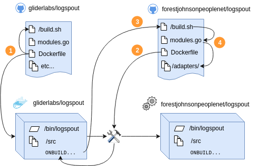

# Custom Logspout Build

Forking logspout to change modules is unnecessary! Instead, you can create an
empty Dockerfile based on `gliderlabs/logspout:master` and include a new
`modules.go` file as well as the `build.sh` script that resides in the root of
this repo for the build context that will override the standard one.

## Diagram of custom build process



  1. GliderLabs builds a version of logspout from source as normal.
    * `docker build` starts building the `Dockerfile`, which triggers `build.sh` to be executed inside a container with the source code, producing a container with the source code and a binary.
    * The Dockerfile contains `ONBUILD` command which will be executed on any docker builds which use the resulting image as a base image.
  2. Someone builds a custom version of logspout from my fork.
    * `docker build` starts building the `Dockerfile` from `forestjohnsonpeoplenet/logspout`.
  3. The `ONBUILD` command from Step 1 is triggered, and it pulls in `build.sh` and `modules.go` from `forestjohnsonpeoplenet/logspout`.
  4. The `ONBUILD` command from Step 1 executes a modified `build.sh` against a modified `modules.go`, pulling in code from `forestjohnsonpeoplenet/logspout` and recompiling logspout from source with my custom components.

This diagram was created with https://draw.io. If you wish to edit it, open the svg version using https://draw.io.

### `syslogamqp` adapter.

Works with RabbitMQ and [AMQP Messaging Modular Input for Splunk](https://splunkbase.splunk.com/app/1812/)

AMQP configuration variables:

```
AMQP_EXCHANGE: logspout.ex
AMQP_PASSWORD: <password>
AMQP_ROUTING_KEY: '{{index .Container.Config.Labels "com.foo.logspout-amqp-routing-key"}}'
AMQP_USERNAME: logspout
```

Command: `syslogamqp+tls://foo-rabbit:5671?filter.labels=com.foo.logspout-amqp-routing-key:*`

### `http` adapter.

Works with SumoLogic.

Command: `https://foo.collection.us2.sumologic.com?http.gzip=true\&http.path=/receiver/v1/http/blahblahbahblahbase64\&http.crash=false\&http.labels=io.rancher.stack_service.name`

### filter.labels.exclude

Our two custom adapters, `http` and `syslogamqp` use a forked version of the `routes` package with new logic allowing blacklist-mode filtering on docker labels.

	$ docker run \
		--volume=/var/run/docker.sock:/var/run/docker.sock \
		foo-fork/logspout \
		http://foo-host:80?filter.labels.exclude=io.rancher.stack.name:ipsec,io.rancher.stack.name:network-services
